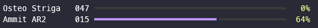

# Destiny Weapon Level Tracker

A quickly put together tool that can be run in the terminal to see the weapon level of crafted weapons in Destiny 2.

## Setup

**Requires python 3.11**

- Grab your member id and a character id from the bungie.net website
- Make sure `Show my non-equipped Inventory` is checked in your bungie.net privacy settings
- Get a token from Bungie's API registration portal
- Create a virtual environment, activate it, and `pip install -r requirements.txt`
- Create a `config.toml` file with the membership id, character id, and api token
- Run `python main.py`
